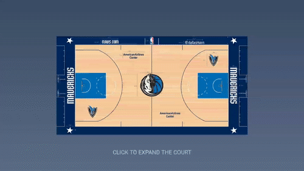
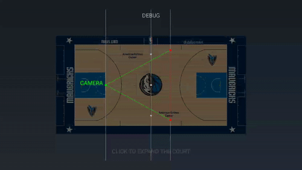

# NBACourt

Demo of `android.graphics.Camera` - display a 3D NBA court ( ͡° ͜ʖ ͡°)✧

↑↑↑ SEE SCREENSHOT ↑↑↑

## How do the camera and court move

↑↑↑ SEE SCREENSHOT ↑↑↑

----

- The court floor image is [downloaded from si.com](https://www.si.com/nba/photo/2016/02/03/power-ranking-all-30-nba-floor-designs)

- The pin icon is [designed by Freepik](https://www.freepik.com/free-vector/colorful-map-pointers-template_785767.htm)